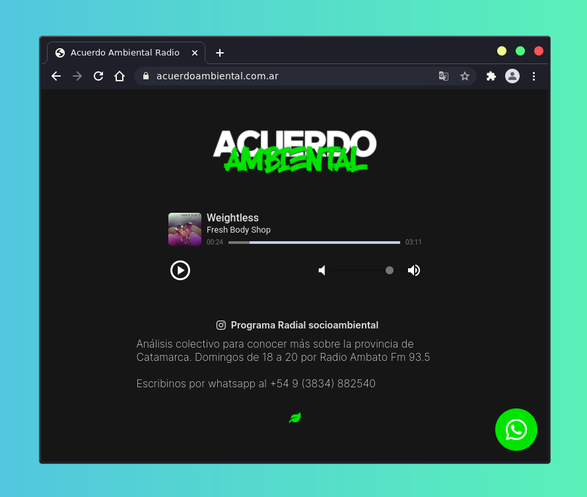

# Acuerdo Ambiental
Landing page del programa radial Acuerdo Ambiental emitido desde El Rodeo, Catamarca.

**update:** nuevo link en: [https://www.acuerdoambiental.com.ar](https://www.acuerdoambiental.com.ar)

Por el momento es solo [una landing page](https://kaenovsky.github.io/nuez-confitada/index.html) para incrustar el servidor de radio [AzuraCast](https://www.azuracast.com/). La idea es pasarlo a una pwa eventualmente.

El servidor Icecast está funcionando en [esta instancia de Linode](https://server.acuerdoambiental.com.ar) con la instalación de Docker.
